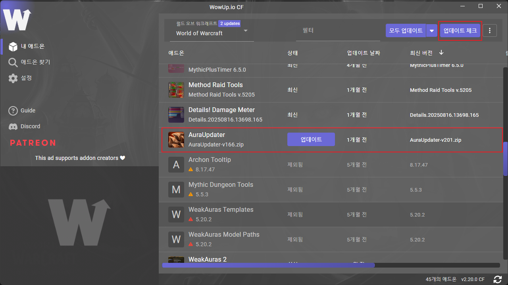

# AuraUpdater 애드온을 통한 Liquid Weakauras 설치 가이드

- **Created At:** 2025-08-15
- **Updated At:** 2025-08-15

현재 방식대로라면 매 시즌마다 Liquid측에서 토큰 정보를 변경하여 구독자에게만 재공유할 것으로 보입니다. 이번 시즌에 사용 가능한 토큰 정보 포함하여 가이드 작성하였으니 참고 바랍니다.

해당 내용 중 토큰 정보는 가급적이면 외부 공유 자제 부탁드립니다.

토큰을 제공해주신 모 도적님에게 감사드립니다.

<details>

<summary>기존 사용자용 업데이트 가이드</summary>

### 1. WowUp 애드온 GitHub Personal Access Token 변경

1. WowUp 실행
2. 설정 > 애드온 > GitHub Personal Access Token에서 Persornal Access Token에 아래 값 입력

```
기존 토큰 정보 삭제
```

<figure><figcaption></figcaption></figure>

3. 업데이트 체크 후 AuraUpdater 애드온 업데이트

<figure><figcaption></figcaption></figure>

### 2. 인게임에서 AuraUpdater를 통해 Liquid Weakauras 업데이트

1. /au 입력
2. 필요 Weakauras 업데이트&#x20;

<figure><figcaption></figcaption></figure>

</details>

<details>

<summary>신규 사용자용 설치 가이드</summary>

### 1. WowUp 설치

* [WowUp 공식 사이트](https://wowup.io/)에서 다운로드 및 설치

### 2. WowUp 애드온 GitHub Personal Access Token 설정

1. WowUp 실행
2. 설정 > 애드온 > GitHub Personal Access Token에서 Persornal Access Token에 아래 값 입력

```
기존 토큰 정보 삭제
```

<figure><figcaption></figcaption></figure>

### 3. WowUp을 통해 AuraUpdater 설치

1. 애드온 찾기 > URL 주소로 설치 > 아래 주소 입력

```
https://github.com/bart-dev-wow/AuraUpdater
```

<figure><figcaption></figcaption></figure>

2. 설치 클릭&#x20;

<div align="center"><figure><figcaption></figcaption></figure></div>

3. 설치됨!이 뜨면 설치 완료&#x20;

<figure><figcaption></figcaption></figure>

### 4. 인게임에서 AuraUpdater를 통해 Liquid Weakauras 업데이트

1. /au 입력
2. 필요 Weakauras 업데이트&#x20;

<figure><figcaption></figcaption></figure>

</details>
